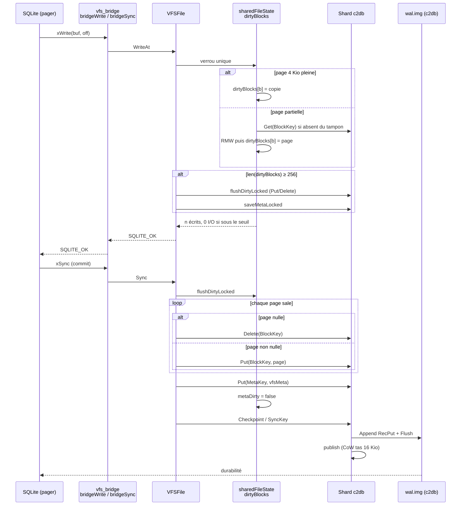
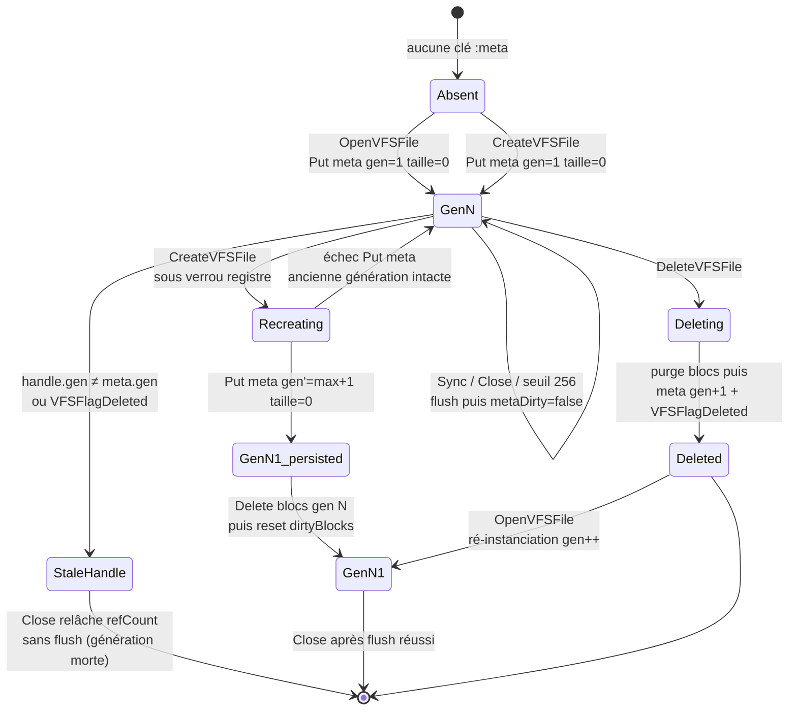

# Architecture VFS SQLite sur c2db — Colocalisation, coalescence et concurrence

Document de référence du pont qui fait vivre SQLite au-dessus du magasin partitionné MVCC `c2db`. Les chemins, constantes et invariants cités sont ceux du paquet `/devhoros/c2simd/c2pkg/c2db`. Aucun chiffre de débit n’est avancé ici : seuls les mécanismes, leurs seuils et les empreintes d’allocation qui en découlent sont opposables.

---

## 1. Introduction et motivation système

### 1.1 Deux contrats d’E/S incompatibles en apparence

SQLite n’est pas un moteur de tuples. C’est un gestionnaire de fichiers qui, via son VFS (`sqlite3_vfs` / `sqlite3_io_methods`), exige un espace d’adressage linéaire, des lectures et écritures à offset (`xRead` / `xWrite`), un `xSync` au commit, une échelle de verrous POSIX (`SHARED` → `RESERVED` → `PENDING` → `EXCLUSIVE`) et des fichiers auxiliaires (`-wal`, `-journal`, `-shm`) dont le cycle de vie est couplé au fichier principal `.db`.

`c2db` est l’inverse d’un système de fichiers. C’est un magasin clé-valeur MVCC découpé en 1024 fragments (`NumShards` dans [`route.go`](route.go)). Chaque fragment possède un seul écrivain, une image `data.img` de 4096 pages de 16 Kio (`defaultHeapPages × pageN` = 64 Mio, [`engine.go`](engine.go)), un journal `wal.img` de 16 Mio (`walBytes`), et une préallocation `fallocate` sous `O_DIRECT` ([`device.go`](device.go), [`DIRECTIVES.md`](DIRECTIVES.md)). Une clé est routée par empreinte BLAKE3 ; une transaction inter-fragments n’existe pas au jalon v1.

Le pont VFS doit donc simuler un fichier POSIX à partir d’un magasin de blocs adressés par clé, sans trahir ni le contrat SQLite ni l’invariant « un écrivain par fragment ».

### 1.2 L’échec du découpage naïf en blocs 4 Kio

La première tentation consiste à mapper chaque page SQLite de 4 Kio (`BlockSize` dans [`vfs_file.go`](vfs_file.go)) sur une clé `c2db` distincte, puis à laisser `Route(key)` disperser ces clés. Une base SQLite d’un mégaoctet contient 256 pages de 4 Kio. En mode WAL, le fichier `-wal`, le `-shm`, éventuellement un `-journal`, et l’enregistrement de métadonnées `:meta` ajoutent des clés supplémentaires. Chacune de ces clés, hashée indépendamment sur 10 bits (`Uint16(sum[:2]) >> 6`), atterrit sur un fragment tiré parmi 1024.

Le nombre de fragments touchés n’est pas 256. Il s’agit de l’occupation d’un tirage avec remise dans 1024 urnes : pour quelques centaines de clés distinctes, l’espérance dépasse déjà deux cents fragments ; avec WAL, journal, shm et métadonnées, l’ordre de grandeur observé est d’environ 500 fragments ouverts.

Chaque fragment ouvert n’est pas un fichier de 4 Kio. L’ouverture alloue :

| Artefact | Constante | Taille préallouée |
| :--- | :--- | ---: |
| Tas B-tree `data.img` | `defaultHeapPages × pageN` | 64 Mio |
| Journal `wal.img` | `walBytes` | 16 Mio |
| **Total par fragment touché** | | **≈ 80 Mio** |

Cinq cents fragments × 80 Mio ≈ 40 000 Mio, soit **environ 41 Gio d’empreinte disque** pour héberger une base SQLite d’un mégaoctet. L’espace n’est pas « clairsemé » au sens d’une économie : `fallocate` réserve les octets. Le pager, les descripteurs, le journal et le tas anonyme MVCC suivent. La base d’un mégaoctet a explosé en un parc de cinq cents mini-bases.

Ce n’est pas un défaut de compaction. C’est un défaut de **localité de routage**. Tant que chaque bloc 4 Kio est une clé autonome, le hachage fait son travail et détruit la localité que SQLite suppose.

### 1.3 Voie C — colocalisation déterministe

La solution retenue n’agrège pas les blocs après coup et ne réduit pas le nombre de fragments du cluster. Elle **force toutes les clés d’un même fichier SQLite, y compris ses auxiliaires, à se hacher sur un seul préfixe canonique**. Le fichier `.db`, le `-wal`, le `-journal` et le `-shm` d’une même base occupent strictement un fragment. L’empreinte redevient celle d’un seul couple `data.img` + `wal.img`, et la charge utile vivante d’une base d’un mégaoctet, une fois les pages nulles omises (blocs sparse VFS) et le tas compacté, se situe dans la plage **26–31 Mio** — un facteur de l’ordre de ×700 à ×1500 selon que l’on compare à l’enveloppe préallouée des cinq cents fragments ou à l’occupation réelle après compaction.

Le reste de ce document décrit cette Voie C, puis le tampon de pages sales qui évite un aller-retour `c2db` par `xWrite`, le scatter-gather multi-fragments de `DB.PutBatch` pour les charges qui ne sont pas VFS, et enfin la dynamique de file d’attente SQLite sans laquelle la colocalisation recréerait un goulot unique.

---

## 2. Architecture de colocalisation (Voie C)

### 2.1 Préfixe canonique `vfsRoutingPrefix`

Toute clé VFS est un identifiant auto-descriptif, à longueurs explicites, qui commence par `vfs:` :

```
vfs:<len(tenant)>:<tenant>:<len(fileID)>:<fileID>[:suffixe]
```

Les constructeurs dans [`vfs_file.go`](vfs_file.go) produisent :

| Constructeur | Forme | Rôle |
| :--- | :--- | :--- |
| `MetaKey(tenant, fileID)` | `vfs:<lt>:<tenant>:<lf>:<fileID>:meta` | Taille, génération, drapeaux (20 octets LE) |
| `BlockKey(tenant, fileID, gen, blockNo)` | `…:g:<gen_u64be>:b:<blockNo_u64be>` | Page logique 4 Kio d’une génération |
| `BlockKeyPrefix(…)` | `…:g:<gen_u64be>:b:` | Préfixe de purge d’une génération |

`Route` ([`route.go`](route.go)) ne hache pas la clé entière dès qu’elle commence par `vfs:`. Elle extrait d’abord un préfixe de routage :

```go
func Route(key []byte) uint16 {
    if bytes.HasPrefix(key, []byte("vfs:")) {
        if prefix := vfsRoutingPrefix(key); prefix != nil {
            sum := blake3archtsim.Sum256(prefix)
            return binary.BigEndian.Uint16(sum[:2]) >> 6
        }
    }
    sum := blake3archtsim.Sum256(key)
    return binary.BigEndian.Uint16(sum[:2]) >> 6
}
```

`vfsRoutingPrefix` parcourt la clé, lit les deux longueurs ASCII, isole `tenant` et `fileID`, **retaille le `fileID` s’il se termine par `-journal`, `-wal` ou `-shm`**, puis reconstruit :

```
vfs:<len(tenant)>:<tenant>:<len(baseFileID)>:<baseFileID>
```

Le code **n’ajoute pas de deux-points terminal** après `baseFileID`. Le préfixe haché est exactement la concaténation ci-dessus. Un parseur défaillant (`longueur absente`, `longueur non numérique`, `longueur débordant `math.MaxInt``) renvoie `nil` : `Route` retombe alors sur le hachage de la clé entière, ce qui est le comportement des clés hors VFS.

Conséquence mécanique : `MetaKey("t", "app.db")`, `BlockKey("t", "app.db", g, n)`, `MetaKey("t", "app.db-wal")` et `BlockKey("t", "app.db-shm", g, 0)` produisent le **même** préfixe `vfs:1:t:6:app.db` et donc le **même** identifiant de fragment. [`vfs_colocation_test.go`](vfs_colocation_test.go) l’établit pour 1001 numéros de bloc et pour les quatre suffixes SQLite, tout en vérifiant qu’une clé hors `vfs:` conserve le hachage intégral, et que huit `fileID` distincts `dbN.db` ne s’effondrent pas sur un seul fragment.

### 2.2 Unification du fichier principal et des auxiliaires

SQLite ouvre, pour une même base, jusqu’à quatre noms :

- `app.db` — image principale ;
- `app.db-wal` — journal d’écriture anticipée SQLite (distinct du `wal.img` de `c2db`) ;
- `app.db-journal` — journal rollback si le mode n’est pas WAL ;
- `app.db-shm` — index de verrouillage partagé du WAL SQLite.

Chacun de ces noms est un `fileID` VFS distinct, donc un `VFSFile` distinct, un `sharedFileState` distinct, une génération distincte. La colocalisation ne fusionne pas ces fichiers en un seul objet : elle **garantit qu’ils occupent le même fragment `c2db`**, donc le même `data.img`, le même écrivain, le même `fdatasync`. Un `xSync` sur le `-wal` SQLite et un `xSync` sur le `.db` ne traversent plus deux journaux `c2db` de 16 Mio.

Le pont [`vfs_bridge.go`](vfs_bridge.go) enregistre un VFS `modernc.org/sqlite` (`RegisterC2DBVFS`). `bridgeOpen` normalise le chemin, prend le nom du VFS comme tenant, et appelle `OpenVFSFile`. Lorsque le `VFSStorage` est un `*DB`, chaque `Put` / `Get` / `Delete` passe par `Route(key)` : la Voie C s’applique. Lorsque le stockage est un `ShardColocatedStorage`, le routage est court-circuité : toutes les clés, quel que soit leur hachage, atterrissent sur le fragment fourni à `NewShardColocatedStorage`.

`RouteFileShard(tenant, baseFileID)` hache `fileIdentityKey`, c’est-à-dire `<lt>:<tenant>:<lf>:<baseFileID>` **sans** le préfixe `vfs:`. Ce n’est pas le même octet que `vfsRoutingPrefix`. Cette fonction sert à *choisir* un fragment pour l’adaptateur `ShardColocatedStorage` ; elle n’est pas l’oracle de `Route` sur les clés `vfs:`. Le chemin canonique, quand le VFS est branché sur un `*DB`, reste `Route(MetaKey(…))` / `Route(BlockKey(…))`.

### 2.3 Confinement spatial et compaction

Une fois le routage collé à un fragment :

1. Un seul `data.img` de 64 Mio et un seul `wal.img` de 16 Mio sont `fallocate`.
2. Les pages VFS nulles ne sont pas persistées : `flushDirtyLocked` appelle `storage.Delete` lorsque `isZeroBlock4K` est vrai (noyau `Page4k_is_zero_avx2` avec repli scalaire). Un trou sparse SQLite ne consomme pas de cellule B-tree.
3. L’auto-compaction `rebuildLatestLocked` reconstruit le tas en ne conservant que les versions vivantes, **en réutilisant les identifiants temporels d’origine** (voir §4.3). Le tas ne gonfle pas d’une génération artificielle à chaque flush VFS.

L’enveloppe préallouée d’un fragment reste 80 Mio. L’occupation *vivante* d’une base SQLite d’un mégaoctet — pages non nulles, métadonnées, journal `c2db` non encore checkpointé — se situe dans la plage 26–31 Mio une fois les zéros omis et le tas resserré. Comparée aux 41 Gio du scatter naïf, la réduction est d’un facteur 700 à 1 500. Le facteur n’est pas une accélération d’E/S ; c’est le rapport de deux empreintes d’allocation.

---

## 3. Le moteur VFS et la coalescence d’écritures (Phase 1)

Implémentation : [`vfs_file.go`](vfs_file.go). Pont SQLite : [`vfs_bridge.go`](vfs_bridge.go). Verrous : [`vfs_locks.go`](vfs_locks.go).

### 3.1 État partagé et registre isolé par instance de stockage

Plusieurs descripteurs SQLite peuvent porter sur le même fichier virtuel (connexions concurrentes, `-wal` ouvert en plus du `.db`). Un `Read-Modify-Write` concurrent sur un bloc 4 Kio sans verrou unique corromprait la page.

`sharedFileState` porte, sous un `sync.Mutex` unique :

| Champ | Fonction |
| :--- | :--- |
| `size` | Taille logique du fichier, visible par tous les handles |
| `generation` | Compteur monotone ; un handle dont `generation` diverge est périmé (`ErrStaleHandle`) |
| `refCount` | Nombre de handles ; à zéro, l’entrée quitte le registre |
| `dirtyBlocks` | Tampon des pages 4 Kio non encore persistées |
| `metaDirty` | Métadonnées (taille / génération / drapeaux) non encore écrites |

`fileRegistry` indexe ces états par `fmt.Sprintf("%p:%s", storage, fileIdentityKey(tenant, fileID))`. Le pointeur d’interface `VFSStorage` **isole les instances** : deux `*DB` ou deux mocks qui portent les mêmes `(tenant, fileID)` ne partagent pas le tampon sale. [`vfs_file_test.go`](vfs_file_test.go) le vérifie : contaminer `dirtyBlocks` d’un stockage ne doit pas apparaître dans l’autre, et les tranches de pages ne sont pas aliasées.

Le registre global `globalFileRegistry` est le seul ; l’isolation est dans la clé, pas dans une multiplication de registres.

### 3.2 Tampon de pages sales (`dirtyBlocks`)

`WriteAt` n’appelle pas `storage.Put` pour chaque `xWrite`. Il coalesce dans `dirtyBlocks map[uint64][]byte` :

- **Page pleine** (`offsetInBlock == 0 && writeLen == BlockSize`) : une copie de 4096 octets remplace l’entrée. Aucune lecture préalable.
- **Page partielle** : si l’entrée n’existe pas encore, lecture du bloc persistant (ou zéros si `ErrNotFound`), puis copie du fragment. C’est le Read-Modify-Write classique, sous le verrou de `sharedFileState`.
- Si `off + len(buf)` dépasse `size`, la taille logique est étendue et `metaDirty` passe à vrai.
- Si `len(dirtyBlocks) >= dirtyFlushThreshold` (**256 pages = 1 Mio**), un flush forcé s’exécute sous le même verrou. C’est le seuil de sécurité mémoire, pas un substitut de `xSync`.

`ReadAt` consulte **d’abord** `dirtyBlocks[blockNo]`. Une page sale non encore persistée est servie en priorité ; le magasin n’est interrogé que pour les blocs absents du tampon. Un trou sparse (`ErrNotFound`) se lit comme 4096 octets nuls, conformément au contrat SQLite (`SQLITE_IOERR_SHORT_READ` au-delà de `FileSize`, zéro-fill du reliquat).

Les offsets sont protégés par arithmétique soustractive : `off < 0`, `len(buf) > MaxInt64-off`, `off == MaxInt64` sont rejetés (`ErrInvalidOffset`). La forme `addr + len <= limit` est interdite.

### 3.3 Flush unifié

Trois événements vident le tampon vers `c2db` :

| Déclencheur | Appelant SQLite / VFS | Effet |
| :--- | :--- | :--- |
| `VFSFile.Sync` | `bridgeSync` ← `xSync` (commit SQLite, `fdatasync` logique) | `flushDirtyLocked` puis relais `SyncKey` / `Sync` / `Flush` / `Checkpoint` |
| `VFSFile.Close` | `bridgeClose` ← `xClose` | Flush si `dirtyBlocks` ou `metaDirty`, puis `release` du registre |
| Seuil 256 pages | `WriteAt` | Flush sous le verrou, l’écriture en cours est déjà dans le tampon |

`flushDirtyLocked` itère la carte : page nulle → `Delete(BlockKey)` ; sinon → `Put(BlockKey, page)` ; l’entrée est ôtée **après** succès de l’appel. Puis `saveMetaLocked` persiste `vfsMeta{size, generation, flags}` (20 octets little-endian). `metaDirty` ne passe à faux **qu’après** ce `Put` réussi.

`Sync` relais ensuite la durabilité matérielle, dans cet ordre de découverte d’interface : `KeySyncer.SyncKey(MetaKey)` (sync ciblé du fragment de la clé), sinon `Syncer.Sync`, sinon `Flusher.Flush`, sinon `Checkpointer.Checkpoint`. `ShardColocatedStorage` implémente les trois derniers par `shard.Checkpoint()`.

Si `Close` échoue pendant le flush, le handle **n’est pas marqué `closed`** et `metaDirty` reste vrai. Un second `Close` reprend la persistance. [`TestVFSFile_MetaDirtyRetryOnFailure`](vfs_file_test.go) injecte une panne sur le `Put` `:meta` et l’établit.

### 3.4 Infaillibilité Copy-On-Write à la recréation

`CreateVFSFile` n’est pas un `Open` qui écrase. C’est un changement de génération, serialisé sous **le verrou du registre** (`globalFileRegistry.mu`) **et** le verrou de l’état :

1. Acquisition exclusive du registre ; `getOrCreateLocked` incrémente `refCount`.
2. Lecture des métadonnées persistées (`oldGen`, `oldSize`) si elles existent.
3. `newGen = max(oldGen, memGen) + 1`.
4. **Persistance d’abord** de `vfsMeta{size: 0, generation: newGen, flags: VFSFlagNormal}`. Si ce `Put` échoue, le registre relâche et l’ancienne génération reste l’autorité.
5. **Puis seulement** boucle `Delete(BlockKey(…, oldGen, b))` sur `numBlocks(oldSize)`.
6. Mutation mémoire : `generation`, `size=0`, `dirtyBlocks` neuf, `metaDirty=false`.

Un crash entre (4) et (5) laisse une génération nouvelle de taille nulle et d’éventuels blocs orphelins de l’ancienne génération. Ces orphelins ne sont plus adressables : `BlockKey` encode la génération sur 8 octets big-endian, et `checkStaleLocked` refuse tout handle dont `generation` ne match plus les métadonnées. Un crash avant (4) laisse l’ancienne génération intacte. Il n’existe pas de fenêtre où les métadonnées pointent vers une génération dont les blocs ont déjà disparu.

`DeleteVFSFile` suit l’ordre inverse de visibilité pour les handles ouverts : purge des blocs, puis métadonnées `VFSFlagDeleted` avec génération incrémentée. Les handles encore ouverts voient `ErrStaleHandle` au prochain I/O.

`OpenVFSFile` sur un fichier marqué supprimé réinstancie : génération++, flags normaux, taille nulle, `Put` des nouvelles métadonnées.

---

## 4. Multi-fragments et scatter-gather (Phase 2)

La Voie C confine **une** base SQLite sur **un** fragment. Les charges qui ne sont pas VFS — ingestion parallèle, collections, clés applicatives — doivent au contraire traverser plusieurs fragments sans sérialiser. `DB.PutBatch` ([`route.go`](route.go)) est ce ventilateur. `Shard.PutBatch` ([`engine.go`](engine.go)) est le groupe de commit local.

### 4.1 Fast-path mono-fragment et éventail

```go
func (db *DB) PutBatch(pairs [][2][]byte) error {
    firstID := Route(pairs[0][0])
    single := true
    for i := 1; i < len(pairs); i++ {
        if Route(pairs[i][0]) != firstID {
            single = false
            break
        }
    }
    if single {
        s, err := db.GetShard(firstID)
        if err != nil { return err }
        return s.PutBatch(pairs)
    }
    // seaux par Route(key), une goroutine par fragment
}
```

Si toutes les clés tombent sur le même fragment — cas VFS colocalisé, cas d’un petit lot homogène — aucun `map`, aucune goroutine : un seul `Shard.PutBatch`. Sinon, un seau `map[uint16][][2][]byte` est rempli par un parcours scalaire `Route(pairs[i][0])`. Le hachage lui-même est `blake3archtsim.Sum256` (noyau BLAKE3 du pôle SIMD). Le partitionnement des paires **n’est pas** un kernel vectoriel d’assignation de seaux : c’est une boucle Go. Présenter ce parcours comme un scatter SIMD serait inexact.

Les seaux non vides deviennent des `shardJob`. Une goroutine par job exécute `job.s.PutBatch(job.pairs)` sous `sync.WaitGroup`. La première erreur est capturée par `sync.Once` ; les autres jobs vont au bout. Il n’y a pas de transaction globale : un fragment peut avoir publié pendant qu’un autre échoue. C’est cohérent avec l’absence de transaction inter-fragments.

[`TestDB_PutBatch_ScatterGatherMultiShards`](engine_test.go) envoie 500 clés, exige au moins deux fragments ouverts, et relit chaque valeur. [`TestDB_PutBatch_ConcurrentParallel`](engine_test.go) lance 8 goroutines de 32 + 8 clés dont un sous-ensemble se recouvre, sous `SetBusyTimeout(5s)`.

### 4.2 Crochet de réplication

Après `publish()` réussi, `Shard.PutBatch` lit `s.replHook` sous `hookMu.RLock` et l’appelle **pour chaque paire** `(shard, RecPut, key, val)`. Le même crochet est posé par `DB.SetReplicationHook` sur le `DB` et propagé à chaque fragment ouvert (`GetShard` recopie `db.replHook`). [`TestDB_PutBatch_ReplicationHookCalled`](engine_test.go) vérifie le fast-path mono-fragment **et** l’éventail multi-fragments : un appel par paire, `recType == RecPut`, valeur identique, `shard == Route(key)`.

Le crochet s’exécute sous le verrou d’écrivain du fragment (`lockWriter`). Un crochet bloquant retient l’écrivain.

### 4.3 `parseUintAscii` et les identifiants de version

`vfsRoutingPrefix` décode les longueurs ASCII par `parseUintAscii`. Avant chaque `n = n*10 + digit`, le prédicat

```go
if n > (math.MaxInt-9)/10 { return 0, false }
```

rejette tout débordement signé. Une clé `vfs:9223372036854775808:…` ne panique pas et ne produit pas un `lt` négatif par wrap : `Route` retombe sur le hachage intégral. [`TestRoute_MalformedVFSKeysNoPanic`](engine_test.go) couvre ces formes.

`rebuildLatestLocked` (auto-compaction sur `ErrHeapFull` / `errInsert`) parcourt le curseur vivant, copie `(clé, valeur, VersionID)` avec `len(id) == BT_IDLen` (**16 octets**), reconstruit un tas anonyme, et réinsère via `applyInsertVer(src, keys[i], ids[i], cellVal)` — **les mêmes 16 octets**, pas un `NewID` frais. `lastID` / `hasLast` sont restaurés. [`engine_test.go`](engine_test.go) pose trois versions, compacte, et exige que `GetAsOf(k, id2)` rende encore `v2`. Une compaction qui renuméroterait les versions casserait toute lecture MVCC `as-of` et tout snapshot VFS qui s’appuierait sur ces identifiants.

### 4.4 Barrière d’un lot et cadence de pointage du journal

Un `Shard.PutBatch` n’émet qu’une seule barrière matérielle : la `fdatasync` du journal à la fermeture du pack (`WAL.EndPack`). Les pages du tas touchées par le lot sont ensuite matérialisées sur `data.img` par `Pager.FlushDirtyNoBarrier`, qui écrit les pages et leurs étiquettes de sceau sans `fdatasync` et libère les emplacements du cache de pages. La barrière `data` est différée au prochain pointage (`Shard.checkpointLocked`), à la compaction ou à la fermeture. Cette séparation est nécessaire pour qu’un lot de N paires ne coûte pas deux `fdatasync` sur des dispositifs distincts. La seule exception est la présence d’une valeur en débordement : ses pages doivent être durables **avant** l’enregistrement WAL qui les référence, donc `PutBatch` émet alors la barrière `data` avant `EndPack` (`hasOverflow`). Pour les valeurs en ligne, le journal porte la charge utile et suffit au rejeu.

Le chemin groupé hors lot (`Shard.leaveGroup`, employé par `Tx.Commit`, `ExecC2QL` et le groupe de routes) applique le même régime : il referme le pack sans barrière (`WAL.EndPackNoFlush`) puis n’émet la `fdatasync` du journal que si des octets restent non synchronisés (`WAL.SyncIfDirty`, drapeau `WAL.synced`). Une transaction qui a déjà vidé son journal avant publication — condition d’atomicité « durable avant visible » — ne paie donc pas de seconde barrière ; un lot groupé non encore vidé est scellé une fois. Les pages du tas sont matérialisées sans barrière (`Pager.FlushDirtyNoBarrier`), exactement comme pour `PutBatch`. Cette symétrie est indispensable au banc de latence sous lecture saturante : sans elle, un commit transactionnel émettait deux barrières de journal et deux barrières de données, et les écrivains ne soutenaient plus la saturation.


La cadence de pointage est déclenchée par le franchissement du seuil `WAL.NeedsRecycle`, fixé à la moitié de la capacité du journal, et évalué à la fin d’un `PutBatch`. Ce pointage enchaîne trois opérations : la barrière du pager, l’écriture d’un enregistrement de pointage scellé (`WAL.Checkpoint`), puis la troncature `WAL.TruncateCheckpoint`. La troncature réécrit le point d’entrée au LBA 0 et remet à zéro les blocs `[nKeep, oldNext)` : cette remise à zéro est indispensable, car `WAL.scanTip` arrête la reprise au premier bloc dépourvu de magie et rejouerait sinon des enregistrements périmés. Le volume remis à zéro par cycle est donc égal à l’avance du journal depuis le pointage précédent, c’est-à-dire au seuil : le coût total amorti est indépendant de la fréquence, seul le découpage entre pics change. Le seuil est conservé à la moitié comme arbitrage documenté : il borne la taille du pic de pointage sans multiplier les `fdatasync` de journal.

La cadence est indépendante de la borne temporelle de fenêtre du committer (`defaultCommitWindow`, 2 ms) qui gouverne le pointage du journal. Un pointage force un `flushWAL` ; il peut donc resserrer la fenêtre de perte, jamais la relâcher, et ne modifie pas la vitesse de reprise, la troncature exigeant la barrière préalable du pager (`rejeu → publication → FlushDirty → troncature`). `Shard.WALCheckpointStats` expose le nombre de pointages, leur coût cumulé et le plus long, pour la métrologie.

Sur la charge réelle, un journal réduit à 2 Mio franchit le seuil tous les 129 lots de 32 paires, pour un pointage moyen de 3,0 ms et une remise à zéro qui domine le coût ; le pointage explicite sur un shard au repos coûte 0,33 ms. Le coût amorti par lot reste de l’ordre de 23 µs.

---

## 5. Concurrence SQLite et dynamique de file d’attente (Phase 3)

### 5.1 Un seul écrivain par base, pas par processus

SQLite, sur un fichier donné, n’admet qu’un écrivain. L’échelle de verrous de [`vfs_locks.go`](vfs_locks.go) le reproduit en mémoire :

| État | Condition d’acquisition | Échec |
| :--- | :--- | :--- |
| `LockShared` | aucun holder ≥ `PENDING` | `ErrBusy` |
| `LockReserved` | le demandeur est `SHARED` ; aucun autre ≥ `RESERVED` | `ErrBusy` / `ErrLockSequence` |
| `LockPending` | le demandeur est `RESERVED` | `ErrBusy` |
| `LockExclusive` | passage par `PENDING` ; aucun autre holder | `ErrBusy` tant que des `SHARED` survivent |

`bridgeLock` traduit `ErrBusy` en `SQLITE_BUSY`. SQLite, de son côté, n’attend que si un `busy_timeout` (BTO) est posé : le busy-handler C dort et réessaie `xLock`. Sans BTO, `SQLITE_BUSY` remonte immédiatement au client Go.

Ce verrou VFS est **orthogonal** au `writeMu` du fragment `c2db` (`lockWriter` / `tryWriteMu` dans [`engine.go`](engine.go)). La colocalisation Voie C les superpose : toutes les connexions SQLite d’une même base, plus toutes les écritures `c2db` de ce fragment, concourent au même écrivain matériel.

### 5.2 Trois valeurs de `busy_timeout` et pourquoi deux sont des pièges

`RegisterC2DBVFS`, si le stockage est un `*DB` dont `busyTimeout <= 0`, appelle `db.SetBusyTimeout(5 * time.Second)`. C’est le défaut de confort pour un usage mono-connexion. Il ne convient pas à un harnais concurrent.

| Réglage | Comportement | Effet observé |
| :--- | :--- | :--- |
| **BTO SQLite = 5 s** (et/ou `SetBusyTimeout(5s)` côté fragment) | Le busy-handler C (ou `tryWriteMu`) dort jusqu’à 5 s par tentative. Un test Go qui tient la connexion est bloqué pour toute la durée. Sous `-race` avec des dizaines de goroutines, le temps wall explose : chaque collision coûte des secondes, pas des millisecondes. | File d’attente **inerte**. Le test « passe » en paraissant lent, ou saute le budget CI. |
| **BTO SQLite = 0** et `SetBusyTimeout(0)` | `SQLITE_BUSY` / `ErrWriterBusy` immédiat. Le client Go réessaie en boucle serrée. Les goroutines se volent le verrou sans jamais céder assez longtemps pour qu’un commit se termine. | **Tempête de retries** et famine. Le CPU tourne, le débit utile s’effondre. |
| **BTO SQLite = 150 ms**, `SetBusyTimeout(0)` côté fragment, backoff Go plafonné à 50 ms | SQLite attend jusqu’à 150 ms *dans* le busy-handler, assez pour absorber un `xSync` + commit court. Le fragment `c2db` ne retient pas 5 s : il rend `ErrWriterBusy` tout de suite, que `vfsBusyOr` mappe en `SQLITE_BUSY`. Le client Go ([`vfs_integration_fixture_test.go`](vfs_integration_fixture_test.go)) applique un backoff exponentiel 1 ms → **50 ms** avec jitter, plafond 5000 tentatives. | File **fluide**. L’attente courte est en C (là où SQLite sait réessayer `xLock`) ; le backoff long est en Go (là où l’on peut jitter et abandonner). |

[`TestVFSIntegration_ExtremeConcurrentFuzzing`](vfs_integration_fixture_test.go) encode ce triplet : `RegisterC2DBVFS` (qui poserait 5 s), puis **`c2dbInstance.SetBusyTimeout(0)`**, DSN `_busy_timeout=150` + `PRAGMA busy_timeout = 150`, backoff Go `maxBackoff = 50 * time.Millisecond`, 32 goroutines × 20 opérations, 70 % d’écritures. L’oracle n’est pas « absence de SQLITE_BUSY » : c’est la conservation de la masse monétaire et l’absence de lost update, *après* épuisement de la file.

Les bancs opposés ([`benchcmp/opposed_bench_test.go`](benchcmp/opposed_bench_test.go), [`bench_concurrency.md`](benchcmp/bench_concurrency.md)) utilisent `PRAGMA busy_timeout=5000` **sur SQLite fichier**, pas sur le VFS `c2db` : c’est un autre contrat, celui du concurrent disque, et il ne doit pas être copié sur le pont.

### 5.3 Parallélisation licite

La colocalisation interdit de paralléliser les écrivains **d’une même base**. Elle n’interdit pas :

1. **Plusieurs bases SQLite**, donc plusieurs `fileID` / plusieurs préfixes de routage, donc plusieurs fragments, donc plusieurs `PutBatch` et plusieurs écrivains `c2db` simultanés.
2. **Lecteurs SQLite** en `SHARED` tant qu’aucun `PENDING`/`EXCLUSIVE` n’est posé — le WAL SQLite est fait pour cela ; le `-wal` et le `.db` étant sur le même fragment, le lecteur VFS ne traverse pas un second `data.img`.
3. **Charges hors VFS** sur les 1023 autres fragments, via `DB.PutBatch` scatter-gather, sans croiser les clés `vfs:`.

Vouloir « 32 écrivains SQLite sur fuzz.db » est un non-sens structurel. Vouloir 32 bases colocalisées sur 32 fragments, ou 32 lecteurs plus un écrivain, est le dessin correct.

---

## 6. Diagrammes

### 6.1 Flux `xWrite` → tampon sale → `xSync` → journal `c2db`



Aucun `xWrite` intermédiaire n’impose un `fdatasync`. Le journal `c2db` n’avance qu’au flush, c’est-à-dire au `xSync` SQLite, à la fermeture, ou au franchissement du seuil d’un mégaoctet.

### 6.2 Machine à états de génération de fichier



L’invariant de cette machine : **les métadonnées de la nouvelle génération sont durables avant la destruction des blocs de l’ancienne**. Un handle dont la génération a divergé ne flush plus, ne lit plus, et quitte le registre sans réécrire les métadonnées d’un successeur.

---

## 7. Cartographie des fichiers

| Fichier | Rôle dans cette architecture |
| :--- | :--- |
| [`route.go`](route.go) | `NumShards=1024`, `Route`, `vfsRoutingPrefix`, `parseUintAscii`, `DB.PutBatch` scatter-gather, `SetBusyTimeout` |
| [`vfs_file.go`](vfs_file.go) | `VFSFile`, `sharedFileState`, `fileRegistry`, clés `MetaKey`/`BlockKey`, coalescence, COW de génération, `ShardColocatedStorage` |
| [`vfs_bridge.go`](vfs_bridge.go) | Enregistrement `sqlite3_vfs`, `xOpen`…`xSync`…`xLock`, mapping `ErrBusy` → `SQLITE_BUSY`, BTO défaut 5 s |
| [`vfs_locks.go`](vfs_locks.go) | Échelle POSIX in-process, un `FileLockState` par `tenant/path` |
| [`engine.go`](engine.go) | `Shard.PutBatch`, `replHook`, `lockWriter`/`tryWriteMu`, `rebuildLatestLocked`, constantes 64 Mio / 16 Mio |
| [`vfs_colocation_test.go`](vfs_colocation_test.go) | Oracle de colocalisation `.db` / `-wal` / `-journal` / `-shm` |
| [`vfs_file_test.go`](vfs_file_test.go) | Registre isolé, `metaDirty` résilient, adaptateur colocalisé |
| [`vfs_integration_fixture_test.go`](vfs_integration_fixture_test.go) | Cycle relationnel, durabilité à froid, fuzz 32 goroutines, BTO 150 ms + backoff 50 ms |
| [`engine_test.go`](engine_test.go) | Scatter-gather, crochet de réplication, IDs de version après compaction, clés `vfs:` malformées |

---

## 8. Invariants opposables

1. Toutes les clés `vfs:` d’un couple `(tenant, baseFileID)` — blocs, métadonnées, suffixes `-wal`/`-journal`/`-shm` — routent vers un unique fragment parmi 1024.
2. Un `xWrite` sous le seuil de 256 pages n’émet aucun `Put`/`Delete` vers `c2db`.
3. Un `xSync` persiste d’abord les pages sales, ensuite les métadonnées, ensuite le checkpoint du fragment.
4. `CreateVFSFile` n’efface les blocs de la génération N qu’après le `Put` réussi de la génération N+1.
5. `metaDirty` reste vrai tant que `saveMetaLocked` n’a pas réussi ; un `Close` en échec n’est pas un `Close`.
6. `rebuildLatestLocked` réinsère les identifiants de 16 octets d’origine ; un `GetAsOf` antérieur au compactage reste bit-exact.
7. `parseUintAscii` refuse tout entier qui déborderait `math.MaxInt` ; `Route` ne panique pas sur une clé `vfs:` hostile.
8. SQLite reste mono-écrivain par `fileID`. La parallélisation se fait par bases distinctes (préfixes distincts) ou par lecteurs `SHARED`, pas par multiplication d’écrivains sur le même `.db`.